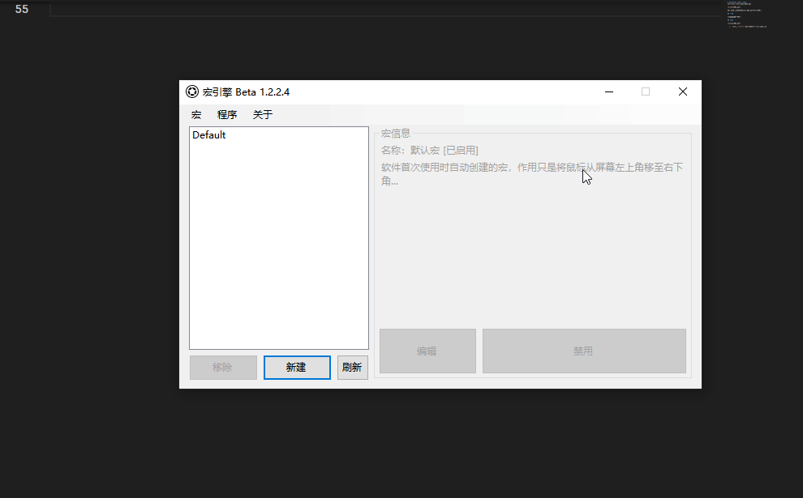

# Cb-getobj 剪贴板-粘贴
[主页](/wiki/Home.md) / [Macro Engine 指令百科](/wiki/Command.md) / [主指令](/wiki/Command.md) / **Cb-getobj 剪贴板-粘贴**

---

取出剪贴板内的内容，其实就是模拟Ctrl+V点击

## 参数

*(此指令无参数)*

## 示例

  1. `鼠标-置坐标`将鼠标移到输入框内
  2. `鼠标-按键`模拟鼠标左键，获得输入框焦点
  3. `剪贴板-粘贴`将剪贴板内的"Hello world!"粘贴进输入框内
