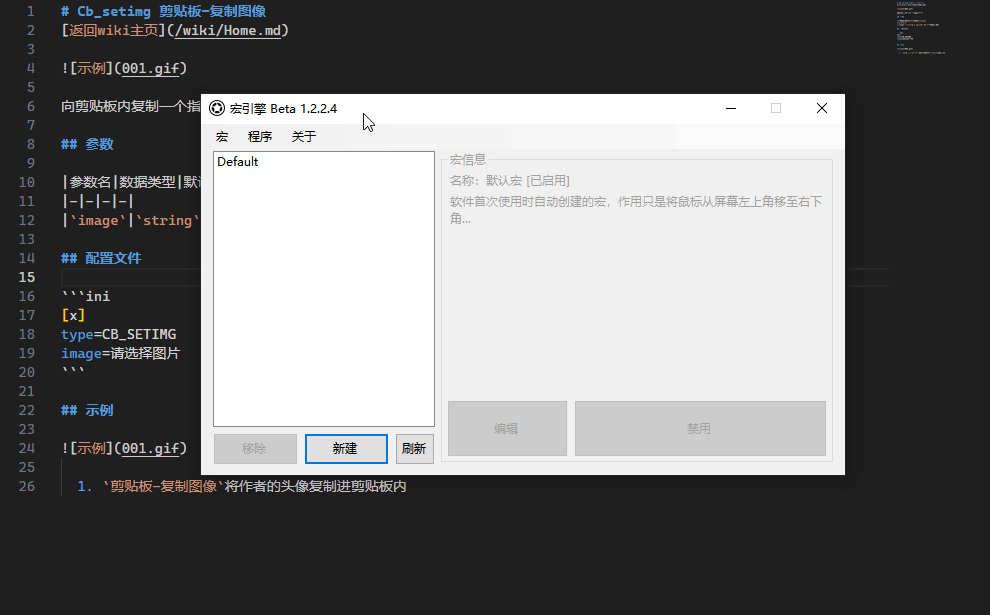

# Cb-setimg 剪贴板-复制图像
[主页](/wiki/Home.md) / [Macro Engine 指令百科](/wiki/Command.md) / [主指令](/wiki/Command.md) / **Cb-setimg 剪贴板-复制图像**

---



向剪贴板内复制一个指定图像

## 参数

|参数名|数据类型|默认值|用法|
|-|-|-|-|
|`image`|`string`|`请选择图片`|图片的路径|

## 配置文件

```ini
[x]
type=CB_SETIMG
image=请选择图片
```

## 示例


  1. `剪贴板-复制图像`将作者的头像复制进剪贴板内