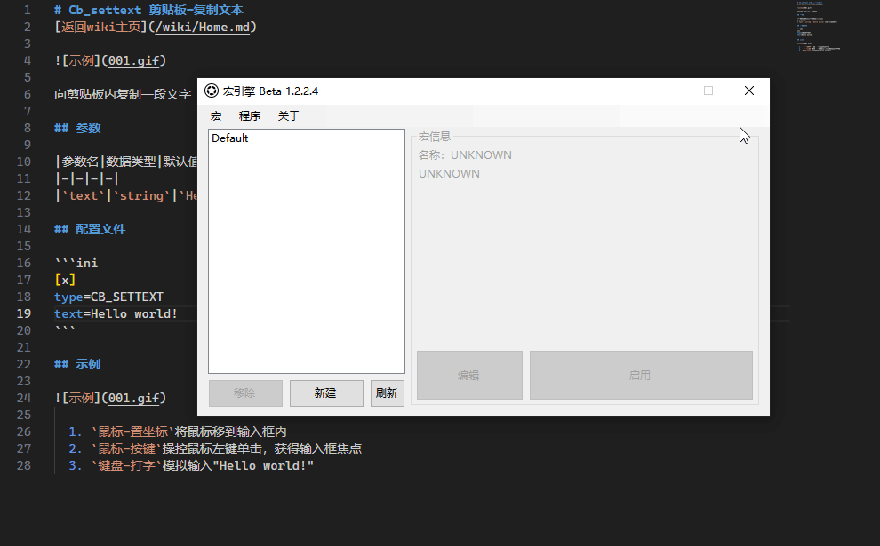

# Cb-settext 剪贴板-复制文本
[主页](/wiki/Home.md) / [Macro Engine 指令百科](/wiki/Command.md) / [主指令](/wiki/Command.md) / **Cb-settext 剪贴板-复制文字**

---



向剪贴板内复制一段文字

## 参数

|参数名|数据类型|默认值|用法|
|-|-|-|-|
|`text`|`string`|`Hello world!`|要复制的文字|

## 配置文件

```ini
[x]
type=CB_SETTEXT
text=Hello world!
```

## 示例


  1. `剪贴板-复制文本`将"Hello world!"复制进剪贴板内