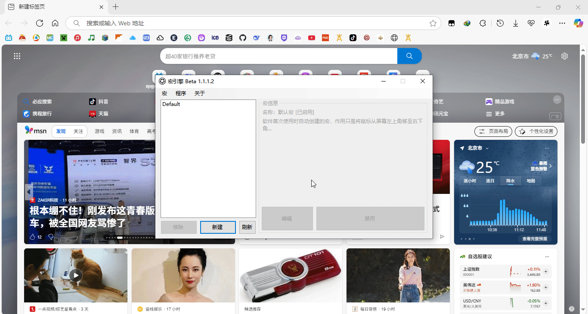

# Kbd-Press 键盘-按键



模拟键盘的按键点击，操作包括`单击、按下、抬起`

## 参数

|参数名|数据类型|默认值|用法|
|-|-|-|-|
|`pkey`|`int`|`0`|组合按键  0无  1`Ctrl`键  2`Shift`键  3`Alt`键|
|`keytype`|`int`|`0`|类型  0单击  1按下  2抬起|
|`key`|`Keys`|`A`|要按下的按键|

## 配置文件

```ini
[x]
type=KBD_PRESS
pkey=0
keytype=0
key=A
```

## 示例


  1. `鼠标-置坐标`将鼠标移至地址栏
  2. `鼠标-按键`操控鼠标左键单击，获得输入框焦点
  3. `键盘-按键`模拟键盘输入字母`A`