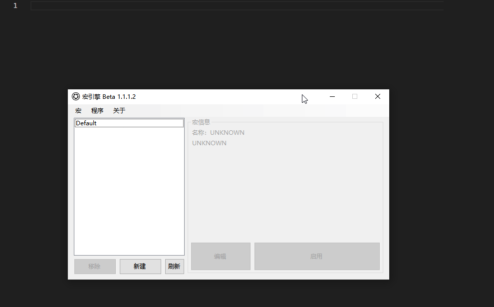

# Kbd_type 键盘-打字



模拟键盘连贯的打字，使用剪贴板的复制与粘贴功能实现，在使用此命令之前要**保证剪贴板内无重要信息**。此操作会**覆盖剪贴板的内容**

## 参数

|参数名|数据类型|默认值|用法|
|-|-|-|-|
|`text`|`string`|`Hello world!`|要输入的文字，中英不限，字符不限|
|`delay`|`int`|`100`|每次输入字符的间隔|

## 配置文件

```ini
[x]
type=KBD_TYPE
text=Hello world!
delay=100
```

## 示例


  1. `鼠标-置坐标`将鼠标移到输入框内
  2. `鼠标-按键`操控鼠标左键单击，获得输入框焦点
  3. `键盘-打字`模拟输入"Hello world!"