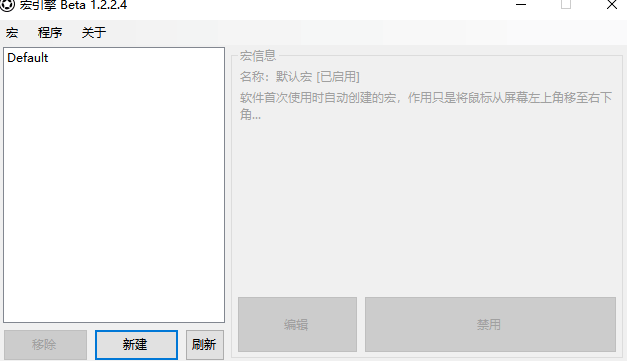

# Msgbox 弹出信息框
[主页](/wiki/Home.md) / [Macro Engine 指令百科](/wiki/Command.md) / [主指令](/wiki/Command.md) / **Msgbox 弹出信息框**

---



弹出自定义标题与内容的信息框，可用于报告脚本运行进度等

## 参数

|参数名|数据类型|默认值|用法|
|-|-|-|-|
|`title`|`string`|`Hello title!`|信息框的标题|
|`text`|`string`|`Hello world!`|信息框的内容|

## 配置文件

```ini
[x]
type=MSGBOX
title=Hello title!
text=Hello world!
```

## 示例


  1. 重复多次`鼠标-置坐标`改变鼠标的坐标
  2. `弹出信息框`弹出一个无标题内容为"Hello world!"的信息框