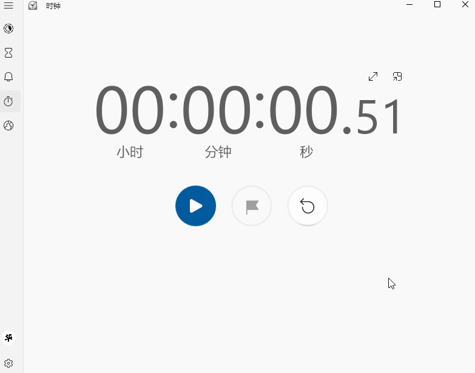

# Wait 等待
[主页](/wiki/Home.md) / [Macro Engine 指令百科](/wiki/Command.md) / [主指令](/wiki/Command.md) / **Wait 等待**

---



等待指定时间后再执行下一个命令，单位：毫秒

## 参数

|参数名|数据类型|默认值|用法|
|-|-|-|-|
|`time`|`int`|`100`|等待的时间|

## 配置文件

```ini
[x]
type=WAIT
time=100
```

## 示例


  1. `鼠标-置坐标`将鼠标移到按钮上
  2. `鼠标-按键`模拟鼠标左键按下，点击按钮，开始计时
  3. `等待`暂停了500毫秒(0.5秒)后继续执行指令
  4. `鼠标-按键`模拟鼠标左键按下，再次点击按钮，暂停计时

  *(虽然有几毫秒的偏差，不过问题不大)*