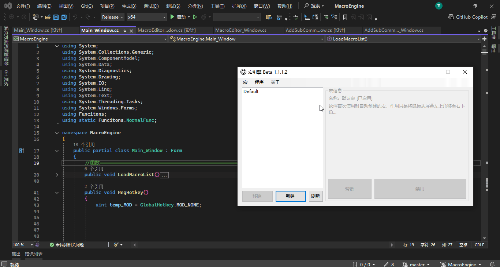

# Mouse-wheel 鼠标-滚轮



模拟鼠标滚轮的`向上`与`向下`滚动

## 参数

|参数名|数据类型|默认值|用法|
|-|-|-|-|
|`dire`|`int`|`0`|方向  0向上  1向下|
|`dis`|`int`|`10`|滚动距离|

## 配置文件

```ini
[x]
type=MOUSE_WHEEL
dire=0
dis=10
```

## 示例


  1. `鼠标-置坐标`将鼠标移到IDE内
  2. `等待`命令使下一条命令500毫秒后再执行，防止操作过快
  3. `鼠标-滚轮`操控鼠标滚轮向下滚动1距离