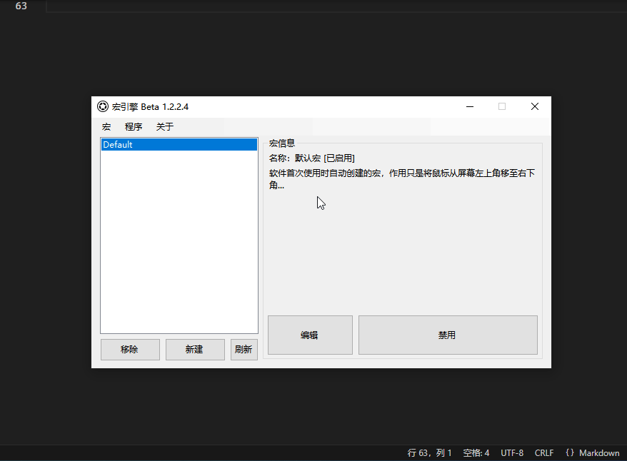

# Sub-for 重复执行
[主页](/wiki/Home.md) / [Macro Engine 指令百科](/wiki/Command.md) / [附加指令](/wiki/Command.md) / **Sub-for 重复执行**

---



重复执行指定次数的主指令

## 参数

|参数名|数据类型|默认值|用法|
|-|-|-|-|
|`SUB_FOR_num`|`int`|`5`|重复次数|
|`SUB_FOR_delay`|`int`|`100`|每次重复的间隔|

## 配置文件

```ini
[x]
type=xxx
subtype=SUB_FOR
SUB_FOR_num=5
SUB_FOR_delay=100
```

## 示例


  1. `鼠标-置坐标`将鼠标移至输入框内
  2. `鼠标-按键`模拟鼠标左键，获得输入框焦点
  3. `键盘-按键 [重复执行]`附加指令重复执行控制`键盘-按键`指令执行10次输入字母`a`的操作